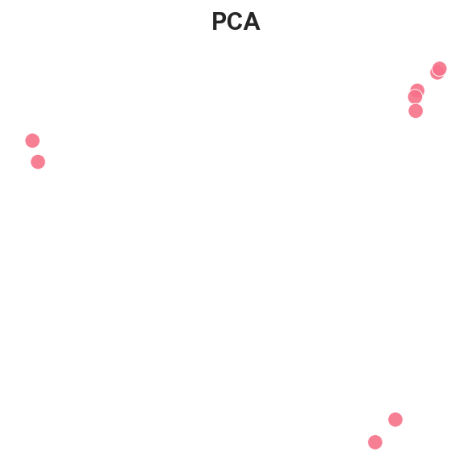
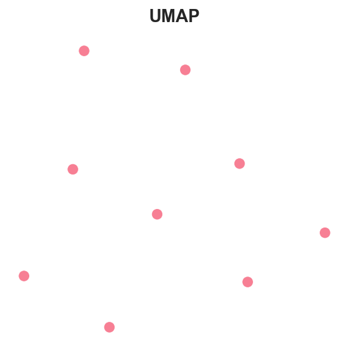

# Embedding-based Image Deduplication

Unsupervised image deduplication and clustering using **CLIP embeddings**, **FAISS indexing**, and **Agglomerative Clustering**.

---

## Overview
This project identifies visually similar or duplicate images by using embeddings in the vision domain and grouping nearby points.

**Pipeline:**
1. **Embedding:** CLIP encodes each image into a 512-D feature vector.  
2. **Indexing:** FAISS stores embeddings for cosine similarity search.  
3. **Clustering:** Agglomerative clustering groups near-duplicates.  
4. **Visualization:** PCA, t-SNE, and UMAP project embeddings to 2D for inspection.

---

## Sample Clusters
Below is a collage of deduplicated clusters generated from a very small sample of images from my gallery.
Each row shows a group of visually similar images.


---

## Embedding Visualizations

| PCA | t-SNE | UMAP |
|:---:|:---:|:---:|
|  |  |  |

**Observations:**
- PCA and t-SNE projections show tight pairwise groupings for near-duplicate images.
- PCA maintains global structure but spreads clusters linearly.
- t-SNE and UMAP capture local neighborhood structure more clearly, duplicate pairs remain close even when the overall space is sparse.
- The dataset is small, so each visible point generally represents a unique image.

---

## Usage
```bash
# Embed and index images
uv run python src/cli.py index --images_dir ./images

# Build FAISS index
uv run python src/cli.py cluster --out_dir ./visioncache_output

# Find similar images
uv run python src/cli.py find --out_dir ./visioncache_output --image ./images/sample.jpg
```

---

## Tech Stack
- **Model:** CLIP ViT-B/32 (Hugging Face)
- **Indexing:** FAISS (cosine similarity)
- **Clustering:** Agglomerative (cosine distance threshold)
- **Visualization:** PCA / t-SNE / UMAP via scikit-learn & umap-learn

---
